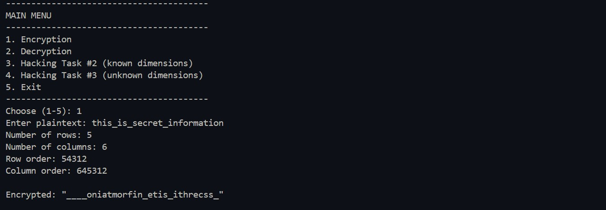
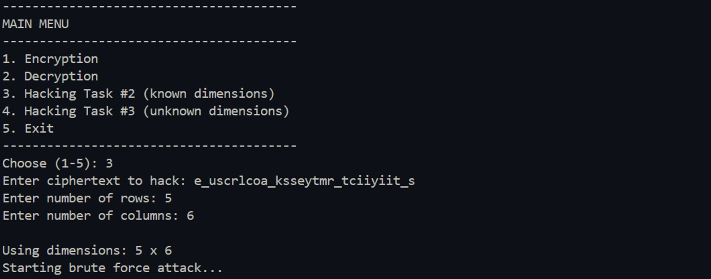
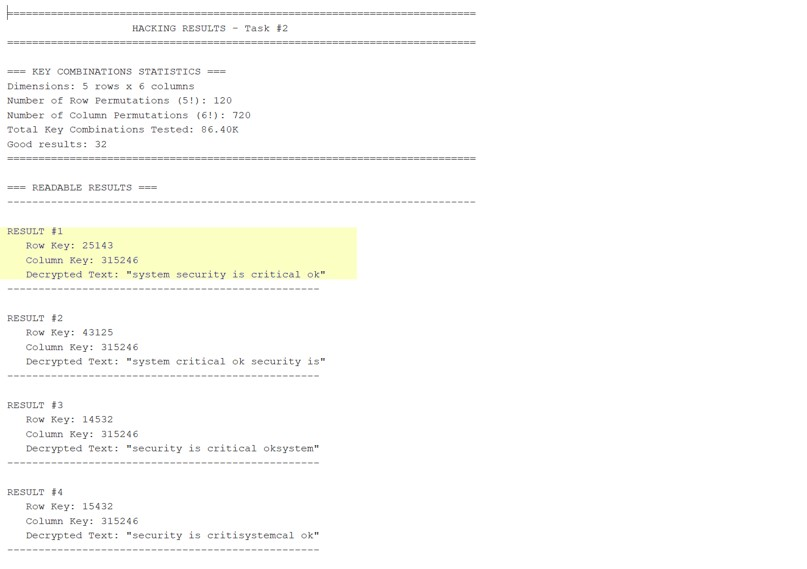

# CipherCracker 🔐

**Double Transposition Cipher with Brute-Force Attack System**

A Java implementation of the Double Transposition encryption algorithm with automated brute-force hacking capabilities. This project demonstrates classical cryptography concepts and attack methodologies.

> **📌 Note:** This is a personal side project developed to explore cryptography, permutation-based algorithms, and automated brute-force techniques.

---

## ✨ Features

| Feature | Description |
|---------|-------------|
| Encryption | Encrypt plaintext using double transposition with custom row and column keys |
| Brute-Force (Known Dimensions) | Test all 86,400 key combinations to decrypt a message (5×6 grid) |
| Brute-Force (Unknown Dimensions) | Automatically find grid dimensions and keys by testing factor pairs |
| English Scoring | Automatic text evaluation using dictionary word matching |
| Interactive Console | User-friendly menu-driven interface with clear output formatting |

---

## 🛠️ Tech Stack

- **Java** (Core)
- Standard Library only (no external dependencies)

---

## 🚀 How to Run

### Prerequisites
- Java JDK 8 or higher
- Command line / terminal

### Steps

```bash
# Compile
javac DoubleTransposition.java

# Run
java DoubleTransposition
```

---

## 📖 Features Implemented

### 1. Encryption System
- User inputs plaintext, grid dimensions (rows & columns), and secret keys for row/column order
- Program fills the grid, rearranges rows and columns according to keys
- Outputs the encrypted ciphertext

### 2. Brute-Force Hacker (Known Grid Size)

Brute-force attack when grid dimensions are known but row/column keys are unknown. Tests all possible permutations of rows and columns, evaluates each result using English dictionary scoring, and displays the highest-scoring decryptions.

---

### 3. Brute-Force Hacker (Unknown Grid Size)

Brute-force attack when both grid dimensions and keys are unknown. The program automatically finds all valid factor pairs of the ciphertext length, filters out impractical dimensions, then runs the brute-force attack on each remaining dimension to find the correct decryption.

---


## 📊 Sample Output


*Figure 1: Encryption task output showing plaintext and ciphertext*



*Figure 1: Brute force attack showing all possible decryption results sorted by score*



*Figure 2: The highest-scoring decryption result with its row and column keys*

---

## 📁 Project Structure

```
CipherCracker/
├── DoubleTransposition.java   # Main implementation
├── README.md                  # Documentation
└── (no external dependencies)
```

---


## 👩‍💻 Author

**Latifah Al-Hussain**

Software Developer  
Riyadh, Saudi Arabia

For questions, feedback, or collaboration opportunities:
- GitHub: [github.com/yourusername](https://github.com/yourusername)
- LinkedIn: [linkedin.com/in/latifah-alhussain](https://linkedin.com/in/latifah-alhussain)
- Email: latifah.alhussain0@gmail.com

---

## 📝 License

This project is for **portfolio and learning purposes only**.
